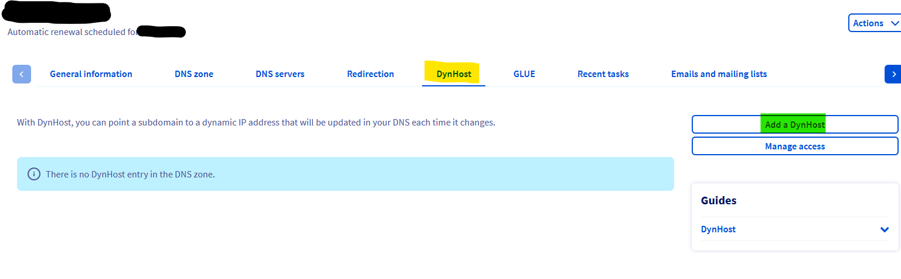
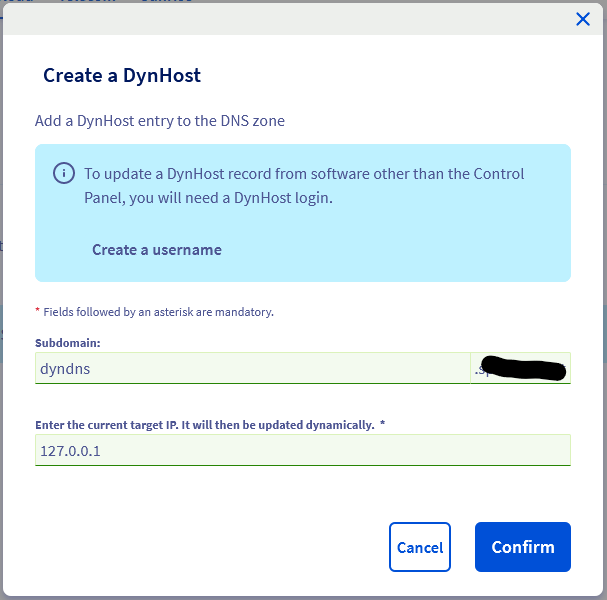
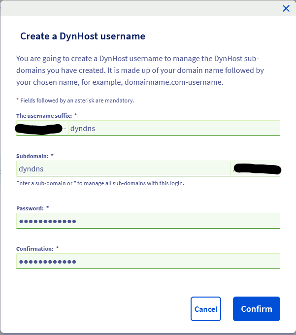

# OVH DynDns Updater

This Tool collects the public ip and writes it in the OVH dns config

## Requirements

- DynHost
- DynHost Access
  - Username
  - Password

---
## Create DynHost
> You need to use a subdomain which is **NOT** already taken

1. Click on DynHost
2. Click on Add a DynHost

3. Define your Subdomain (dyndns.example.com)
4. Specify the current IP (127.0.0.1)

---
## Create DynHost Access

1. Define username sufix (example.com-dyndns)
2. Specify the subdomain the access is allowed to manage (dyndns.example.com)
3. Enter a secure password

